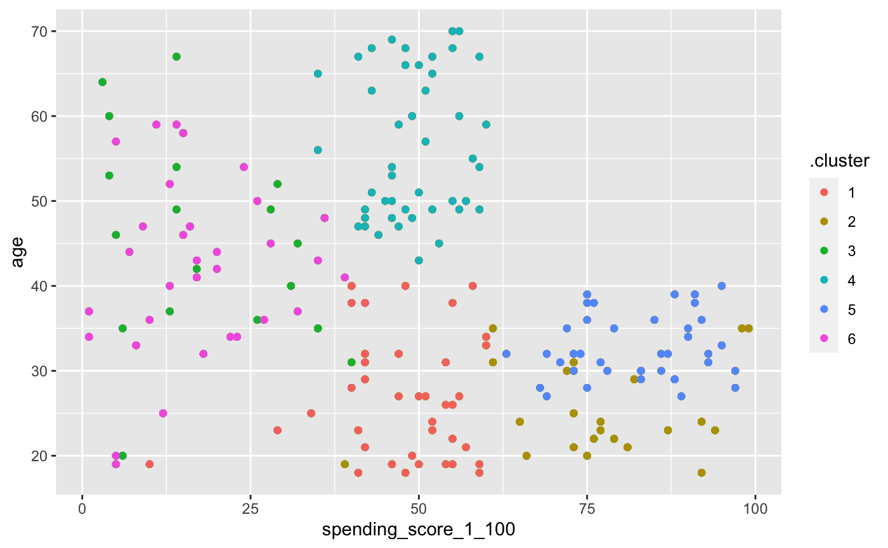
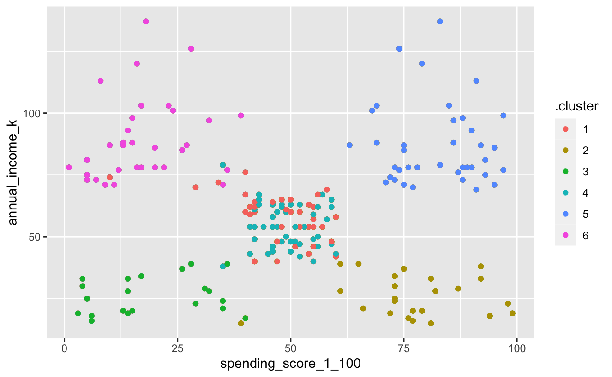
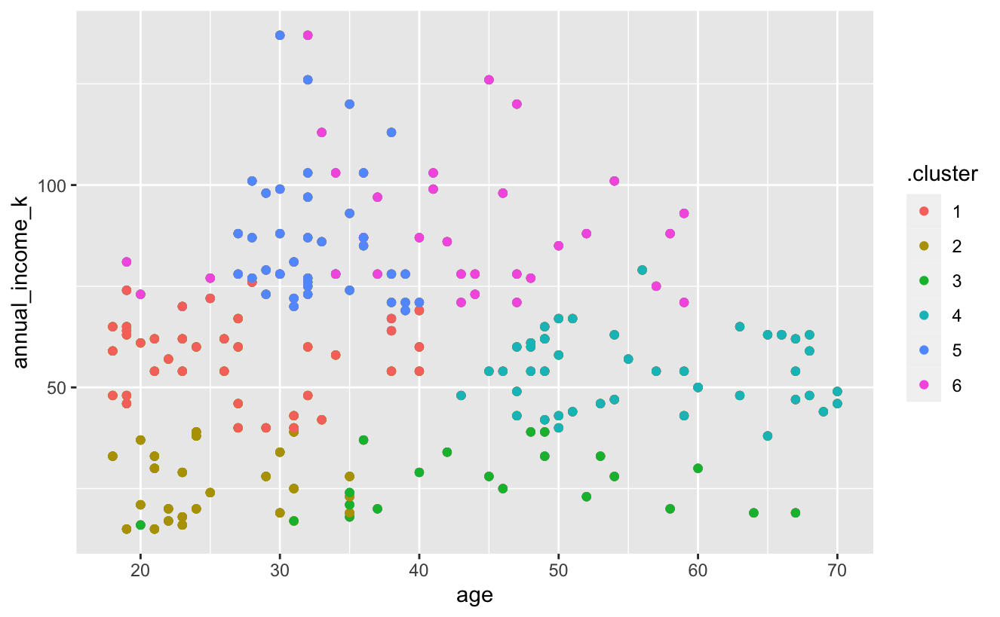

```{r}
library(tidyverse)
library(janitor)
```

```{r}
customers <- read_csv("data/mall_customers.csv")
```

Clustering homework You have been provided some customer data from a shopping centre. Do some exploratory analysis on the data. Comment on findings.

We are interested in creating a marketing campaign to target customers based on their spending score and annual income. Perform a k-means clustering to find if there are meaningful clusters in the data to target the customers.

Perform k-means clustering and chose a value of k.

Visualise the clustering for your chosen value of k.

Do you think the clustering seems a good fit for this data?

Comment on the attributes on one or two of the clusters (maybe even give them a label if you like - like in section 4.1 of the 'Segmentation & clustering intro' lesson).

```{r}
customers <- clean_names(customers)
```

```{r}
customers <- customers %>% 
  select(age:spending_score_1_100)
```

```{r}
customer_scale <- customers %>%
                mutate_if(is.numeric, scale)
customer_scale
```

```{r}
customer_scale %>%
  as_tibble() %>%
  pivot_longer(cols = c(age, annual_income_k, spending_score_1_100), 
               names_to = "type", 
               values_to = "value") %>% #convert data to long format
  group_by(type)%>%
  summarise(mean = round(mean(value)), 
            sd = sd(value))
```

```{r}
customer_clustered <- kmeans(customer_scale, 
                            centers = 6, 
                            nstart = 25)
customer_clustered
```

```{r}
library(broom)

tidy(customer_clustered, 
     col.names = colnames(customer_scale))
```

```{r}
augment(customer_clustered, customer_scale)
```

```{r}
glance(customer_clustered)
```

```{r}
library(broom)

# Set min & max number of clusters want to look at 
max_k <- 20 

k_clusters <- tibble(k = 1:max_k) %>%
  mutate(
    kclust = map(k, ~ kmeans(customer_scale, .x, nstart = 25)), 
    tidied = map(kclust, tidy),
    glanced = map(kclust, glance),
    augmented = map(kclust, augment, customers)
  )

k_clusters
```

```{r}
clusterings <- k_clusters %>%
  unnest(glanced)

clusterings

```

```{r}
ggplot(clusterings, aes(x=k, y=tot.withinss)) +
  geom_point() +
    geom_line() +
    scale_x_continuous(breaks = seq(1, 20, by = 1))
```

```{r}
library(factoextra)

fviz_nbclust(customer_scale, 
             kmeans, 
             method = "wss", 
             nstart = 25)
```

```{r}
fviz_nbclust(customer_scale, 
             kmeans, 
             method = "silhouette", 
             nstart = 25)
```

```{r}
fviz_nbclust(customer_scale, 
             kmeans, 
             method = "gap_stat", 
             nstart = 25, 
             k.max = 10)
```

Looks like 6 is the optimum number of clusters

```{r}
 clusterings %>% 
  unnest(cols = c(augmented)) %>%
  filter(k <= 6) %>%
  ggplot(aes(x = age, y = annual_income_k)) +
  geom_point(aes(color = .cluster))
```

```{r}
 clusterings %>% 
  unnest(cols = c(augmented)) %>%
  filter(k <= 6) %>%
  ggplot(aes(x = spending_score_1_100, y = annual_income_k)) +
  geom_point(aes(color = .cluster))
```

```{r}
 clusterings %>% 
  unnest(cols = c(augmented)) %>%
  filter(k <= 6) %>%
  ggplot(aes(x = spending_score_1_100, y = age)) +
  geom_point(aes(color = .cluster))
```

The clusters are very clear to see on annual income vs spending score - and even suggest that 5 clusters might be more preferable. For the two graphs comparing age as well the clusters are less distinct - so perhaps age could be left out of the model.

Comment on the segments - changed to 5:

```{r}
 clusterings %>% 
  unnest(cols = c(augmented)) %>%
  filter(k <= 5) %>%
  ggplot(aes(x = spending_score_1_100, y = annual_income_k)) +
  geom_point(aes(color = .cluster))
```

```{}
```

Changing to 5 clusters:

Cluster 1 - low income, low spending score

Cluster 2 - high income, high spending score

Cluster 3 - low income, high spending score

Cluster 4 - high income, low spending score

Cluster 5 - middle income, middle spending score

Copies of the clustered graphs (for reference):






